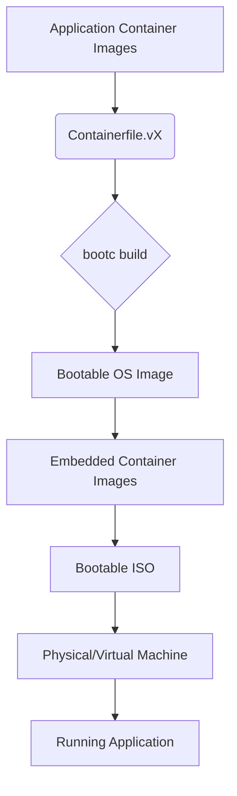

# bootc-embedded-containers

This repository contains examples and procedures for embedding container images into a bootable ISO using `bootc`, focusing on self-contained and disconnected environments with RHEL Image Mode.

## Table of Contents
- [Prerequisites](#prerequisites)
- [Quick Start](#quick-start)
- [Examples](#examples)
- [Utility Scripts](#utility-scripts)
- [General Instructions](#general-instructions)
- [Procedures](#procedures)
- [Experimental - "Delta Updates"](#experimental---delta-updates)

## Prerequisites

To effectively use this repository, you will need the following tools installed on your system:

*   **`bootc`**: The `bootc` tool for building and managing bootable container images.
*   **`podman`**: A container engine for building and managing container images.
*   **`qemu-kvm` / `libvirt`**: For creating and managing virtual machines to test the generated ISOs.
*   **`kubectl` / `oc` (OpenShift CLI)**: For interacting with Kubernetes/OpenShift clusters, especially for the `wordpress` example.
*   **`kustomize`**: Used in the `wordpress` example for managing Kubernetes manifests.
*   **`GoLang` (version 1.22 or higher)**: Required if you plan to build `tar-diff` and `tar-patch` from source for the experimental delta updates.

Ensure these tools are properly installed and configured in your environment.

## Quick Start

Follow these minimal steps to build and boot a basic `bootc` image:

1.  **Download Red Hat Pull Secrets:** Obtain your `.pull-secret.json` from [https://console.redhat.com/openshift/downloads#tool-pull-secret](https://console.redhat.com/openshift/downloads#tool-pull-secret) and place it in the root of this repository.
2.  **Build the Base Image:**
    ```bash
    bash -x build-base.sh
    ```
3.  **Build the `v1` Embedded Image:**
    ```bash
    bash -x build.sh v1
    ```
    This will produce an ISO in the `_build` directory.
4.  **Create a Test VM:** Use `create-vm.sh` to set up a virtual machine for testing the ISO.
    ```bash
    bash -x create-vm.sh
    ```
5.  **Boot the VM with the ISO:** Configure your VM to boot from the generated ISO.

For more detailed instructions, refer to the [Procedures](#procedures) section.

## Examples

This repository provides several examples demonstrating different `bootc` image embedding scenarios:

*   **`Containerfile.v1`**: A basic example showcasing how to embed a single container image into the `bootc` ISO.
*   **`Containerfile.v2`**: An example demonstrating the embedding of multiple container images within a single `bootc` ISO.
*   **`Containerfile.v3`**: Illustrates how to embed a container image with a custom entrypoint, providing more control over the application's startup.
*   **`wordpress/`**: A more complex, real-world example. This demonstrates embedding a complete WordPress application, including its MySQL database, as multiple container images. It also includes Kubernetes manifests (`clusterrolebind.yaml`, `kustomization.yaml`, `mysql-deployment.yaml`, `serviceaccount.yaml`, `wordpress-deployment.yaml`, `wordpress-namespace.yaml`) for deploying the application within a MicroShift environment.

## Utility Scripts

The following scripts in the root directory automate various tasks within this project:

*   **`build-base.sh`**: Builds the foundational `microshift-bootc` base image, which other examples build upon.
*   **`build.sh <version>`**: A versatile script used to build the `bootc` ISOs for the different `Containerfile.vX` examples. Replace `<version>` with `v1`, `v2`, or `v3`.
*   **`copy_embedded_images.sh`**: Copies embedded container images, typically used for preparing images for deployment or transfer.
*   **`create-ks.sh`**: Generates a Kickstart file, often used for automated installations of the `bootc` ISO.
*   **`create-vm.sh`**: Creates a KVM-based virtual machine environment for testing the `bootc` ISOs.
*   **`embed_image.sh`**: A helper script for embedding specific container images into a `bootc` build.

## Building Appliances for self-contained and disconnected environments with RHEL Image Mode (bootc)

[About image mode for Red Hat Enterprise Linux (RHEL)](https://docs.redhat.com/en/documentation/red_hat_build_of_microshift/4.18/html-single/installing_with_rhel_image_mode/index#microshift-bootc-conc_microshift-about-rhel-image-mode): _Image mode for Red Hat Enterprise Linux (RHEL) is a Technology Preview deployment method that uses a container-native approach to build, deploy, and manage the operating system as a bootc image. By using bootc, you can build, deploy, and manage the operating system as if it is any other container._

## Embedding Containers & Physically-bound images: ship it with the bootc image
[Some use cases require the entire boot image to be fully self contained. That means that everything needed to execute the workloads is shipped with the bootc image, including container images of the application containers and Quadlets. Such images are also referred to as “physically-bound images”.](https://docs.fedoraproject.org/en-US/bootc/embedding-containers/#_physically_bound_images_ship_it_with_the_bootc_image)

### Overall Architecture



## General instructions:

Get started within MicroShift and image-mode (bootc) first [https://docs.redhat.com/en/documentation/red_hat_build_of_microshift/4.18/html-single/installing_with_rhel_image_mode/index](https://docs.redhat.com/en/documentation/red_hat_build_of_microshift/4.18/html-single/installing_with_rhel_image_mode/index)
- Then, embeed MicroShift and Application Container Images for offline deployments based on this:
  - [https://github.com/openshift/microshift/blob/main/docs/contributor/image_mode.md#appendix-b-embedding-container-images-in-bootc-builds](https://github.com/openshift/microshift/blob/main/docs/contributor/image_mode.md#appendix-b-embedding-container-images-in-bootc-builds)
  - [https://gitlab.com/fedora/bootc/examples/-/tree/main/physically-bound-images](https://gitlab.com/fedora/bootc/examples/-/tree/main/physically-bound-images)
  - [https://developers.redhat.com/articles/2025/05/29/how-embed-containers-image-mode-rhel#embed_quadlets_into_a_bootc_image](https://developers.redhat.com/articles/2025/05/29/how-embed-containers-image-mode-rhel#embed_quadlets_into_a_bootc_image)

### Procedures

#### Download your redhat pull secrets

To get access to Red Hat registries, download your redhat pull secrets from [https://console.redhat.com/openshift/downloads#tool-pull-secret](https://console.redhat.com/openshift/downloads#tool-pull-secret) and place as local file `.pull-secret.json`.

#### Build the base image

Based on these [procedures](https://github.com/openshift/microshift/blob/main/docs/contributor/image_mode.md#build-microshift-bootc-image), build the base microshift-bootc image:

`bash -x build-base.sh`

#### Build the embedded image

Based on these [procedures](https://github.com/openshift/microshift/blob/main/docs/contributor/image_mode.md#appendix-b-embedding-container-images-in-bootc-builds), using microshift-bootc image built in previous step, embeed the Container Images to your new microshift-bootc-embeed image:

  - `bash -x build.sh v1`.

This will include the MicroShift payload + a sample wordpress Container image to the bootc image. It also produces a ISO image, to be used to install RHDE.

#### Create a test environment (KVM based, isolated network)

- Within your test environment, [create a isolated network](https://github.com/openshift/microshift/blob/main/docs/contributor/image_mode.md#configure-isolated-network).
- Create a test VM with `create-vm.sh`.
- Access VM with user `redhat` and set [kubeconfig access to microshift](https://docs.redhat.com/en/documentation/red_hat_build_of_microshift/4.18/html/configuring/microshift-kubeconfig#accessing-microshift-cluster-locally_microshift-kubeconfig)

#### Build an updated image

Build the second image with `bash -x build.sh v2`.
That will include RHEL updates + a sample mysql Container image to bootc image tagged as V2. It also produces a ISO image.

#### Bootc switch & upgrade

Upgrade live system to v2.
See for additional context [https://docs.fedoraproject.org/en-US/bootc/disconnected-updates/](https://docs.fedoraproject.org/en-US/bootc/disconnected-updates/)

#### Sample: Deploying the WordPress Application

This section demonstrates how to deploy the WordPress application after you have built and booted a `bootc` image that includes the WordPress containers (e.g., using `Containerfile.v1` or `Containerfile.v2` if they embed WordPress, or specifically `wordpress/` example).

1.  **Navigate to the WordPress directory:**
    ```bash
    cd wordpress/
    ```
2.  **Apply Kubernetes manifests:** Use `oc apply -k .` to deploy the WordPress application and its MySQL database.
    ```bash
    oc apply -k .
    ```
    *(Note: Ensure your `kubeconfig` is set up correctly to interact with your MicroShift cluster.)*

3.  **Verify Pods and Images:** You can check the status of your deployed pods and the container images available on the system.
    ```bash
    oc get pods -A
    sudo podman images
    sudo crictl images
    ```
    *(Full command outputs are omitted for brevity. Refer to the original `README.md` or a dedicated lab guide for complete logs.)*

4.  **Check `bootc` and `rpm-ostree` Status:**
    ```bash
    sudo bootc status
    sudo rpm-ostree status
    ```
    *(Full command outputs are omitted for brevity.)*

#### Offload the updated container image to the edge system:
*(Full command outputs are omitted for brevity. Refer to the original `README.md` or a dedicated lab guide for complete logs.)*

Then, get it updated!
*(Full command outputs are omitted for brevity. Refer to the original `README.md` or a dedicated lab guide for complete logs.)*

#### Experimental - "Delta Updates" with tar-diff

```mermaid
graph TD
    A[Old Image &#40;base-image.tar&#41;] --> B{tar-diff}
    C[New Image &#40;updated-image.tar&#41;] --> B
    B --> D[Delta File &#40;delta_update.tar&#41;]
    D --> E{Transfer to Target System/Local Registry}
    E --> F[Target System/Local Registry]
    F --> G[Old Image &#40;base-image.tar&#41;]
    D --> H{tar-patch}
    G --> H
    H --> I[Reconstructed New Image]
    I --> J[Load to Local OCI Registry]
    J --> K[Push to Local Registry]
    K --> L[Target System &#40;bootc switch&#41;]
```



__Note: Kudos to Hrushabh Sirsulwar <hsirsulw@redhat.com> who suggested this approach.__

Traditional container image updates are too large for bandwidth-constrained far-edge devices. To address this, we would like to use delta updates, which only download the changes between layers. This significantly reduces data transfer while ensuring the updated image is identical to the full version.

Although bootc systems are based on OStree, which does support deltas, going through this path is very probamatic from management perspective as you lose all the benefits of bootc going through OCI standards.

while reseraching for solutions, we've find out [`containers/tar-diff`](https://github.com/containers/tar-diff), which is a command-line utility designed to efficiently create and apply binary differences between two tar archives.

Its main purpose is to reduce the size of updates for container images by generating a small "delta" file that represents only the changes between an old image layer and a new one. This delta can then be used with the original layer to reconstruct the new version.

While containers/tar-diff is a functional tool, its application for producing and distributing delta updates for container images is not a universally supported feature across all container registries and engines. This capability exists within a specific ecosystem of tools that have implemented experimental support for OCI image delta updates.

DISCLAIMER: **THIS IS NOT A SUPPORTED UPGRADE PATH FOR BOOTC SYSTEMS. Being tested and documented with the intension of exploration only.**

**Requirements on Build System**
- `base-image.tar` or an equivalent OCI-formatted image
This is the original, older version of the image. The build system needs access to this file to use it as the "before" state for comparison.

- `updated-image.tar` or an equivalent OCI-formatted image
This is the complete, new version of the image that the build system must first produce from the latest source code. It serves as the "after" state for the comparison.

- `tar-diff` binary (from the tar-diff toolset)
This is the essential utility used by the build system to compare the base-image.tar with the updated-image.tar. The tool's output is the delta_base_target.tar file.

**Requirements on Target System**

- Access to a OCI Registry within the same Isolated LAN, although could also be embeeded to the running edge system.

- `base-image.tar` or an equivalent OCI-formatted image
 The base image must be available on-site, but it does not need to reside directly on the edge system. It can be stored on an on-site bastion host, local repository, or any system within the same network. This image will serve as the foundation for applying the delta.


- `delta_base_target.tar` (the delta update)
 This delta file contains only the differences between the base and updated images. It is significantly smaller than the full image and can be transferred to the site over the internet or any suitable medium.

- `tar-patch` binary (from the tar-diff toolset)
 This utility is essential for reconstructing the updated image on the target system. It combines the base image with the delta to produce the final image tarba

##### Updating our Bootc image with latest updates.

Containerfile for updated OCI:
```
#FROM registry.redhat.io/rhel9/rhel-bootc:9.4 ## V1 is RHEL 9.4, EUS based. But with the release of RHEL 9.6 EUS, this UBI is not being updated anymore.
FROM localhost/microshift-4.18-bootc-embeeded:v1 ## our base image does already have the everything included (baseOS, configs, app images)
ENV USHIFT_VER=4.18

# we are just updating the baseOS and eventually MicroShift with latest updates.
RUN dnf config-manager \
        --set-enabled rhocp-${USHIFT_VER}-for-rhel-9-$(uname -m)-rpms \
        --set-enabled fast-datapath-for-rhel-9-$(uname -m)-rpms
RUN dnf update --enablerepo=rhel-9-for-$(uname -m)-baseos-eus-rpms --enablerepo=rhel-9-for-x86_64-appstream-eus-rpms -y --releasever=9.4 && \
    dnf clean all
```

Build:
*(Full command outputs are omitted for brevity. Refer to a dedicated lab guide for complete logs.)*

##### Export Images to .tar

Use podman save to export the images:
```bash
podman save -o base-image.tar localhost/delta-oci-image:v1
podman save -o updated-image.tar localhost/delta-oci-image:v2
```

In our sample here, our updated OCI `microshift-4.18-bootc-embeeded:v2` is built from `microshift-4.18-bootc-embeeded:v1` and it does include only baseOS updates with ~390Mbytes of size.

*(Full command outputs are omitted for brevity. Refer to a dedicated lab guide for complete logs.)*

##### Installing tar-diff and tar-patch from source

[https://github.com/containers/tar-diff.git](https://github.com/containers/tar-diff.git) is not a very active repo, updated 5 years ago. And it does contains the binaries, so, you need to build.
To build it, you need to have GoLang 1.22. So, if you are running on RHEL 9.4+ (maybe even for 9.2), you must download GoLang binaries directly instead of using our rpms.

```bash
wget https://go.dev/dl/go1.22.12.linux-amd64.tar.gz
tar -C /usr/local -xzf go1.22.*.linux-amd64.tar.gz
export PATH=$PATH:/usr/local/go/bin
go version
```

Then, build and install:
```bash
make tar-diff
make build
make install
```
*(Full command outputs are omitted for brevity. Refer to a dedicated lab guide for complete logs.)*

##### Generate Delta Using Tar-Diff

1. Stage Your Images: Ensure both `base-image.tar` and `updated-image.tar` are present.
2. Generate the Delta: Run the `tar-diff` command.

```bash
tar-diff base-image.tar updated-image.tar delta_update.tar
```

As you can see, v1 image have 4761 Mbytes, v2 4761 Mbytes and the **delta only 207 Mbytes**. This is pretty much aligned to the outputs of `dnf updates` when building v2 image:
*(Full command outputs are omitted for brevity. Refer to a dedicated lab guide for complete logs.)*

3. Transfer the Delta: Send the resulting `delta_update.tar` file to your Local Registry & Patching Host.

##### Reconstruct v2 from the delta On the Local Registry

This server acts as the central hub for updates. It will receive the delta, reconstruct the new image, and publish it to its own registry service.

**Requirements**:
- `base-image.tar`: The original image archive.
- `delta_update.tar`: The delta file received from the build system.
- `tar-patch` binary: The utility to apply the patch (see installation steps above).
- An OCI container engine: Typically podman on a RHEL system.
- A running OCI registry service: The registry to which the new image will be pushed.

**Steps:**

1. Prepare Host: Ensure all requirements are met. The `delta_update.tar` has been copied to the server, and `base-image.tar` is available.
2. Extract the base image:
   ```bash
   mkdir base-image
   tar -xf base-image.tar -C base-image
   ```
   *(Full command outputs are omitted for brevity. Refer to a dedicated lab guide for complete logs.)*
3. Reconstruct the Image Archive: Run `tar-patch` to create the full `updated-image.tar`.
   ```bash
   tar-patch base-image.tar delta_update.tar reconstructed_image.tar
   ```

   In this lab, we do have all images available, so we can compare size and hash:
   *(Full command outputs are omitted for brevity. Refer to a dedicated lab guide for complete logs.)*
4. Load the generated image to a local OCI registry:
   ```bash
   podman load -i reconstructed_microshift-4.18-bootc-embeeded-v2.tar
   podman tag microshift-4.18-bootc-embeeded:v2 localhost:5000/microshift-4.18-bootc-embeeded:v2
   podman push localhost:5000/microshift-4.18-bootc-embeeded:v2
   ```

##### Patching Host
In this context, our far-edge system must be installed from the ISO, as for remote locations we distribute the installation medias (USB, DVD, etc) due restricted internet connections. Then, as our far-edge node does have access to a local registry within the same LAN, the first update will be using `bootc switch`.

Check current status of the system:
*(Full command outputs are omitted for brevity. Refer to a dedicated lab guide for complete logs.)*

Upgrade with `bootc switch`:

In this lab we are using a simple and insecure registry, so we need to Add a new registry entry:
Scroll through the file and add the following block. You can add it after the `[registries.insecure]` or `[registries.search]` sections, or at the end of the file.

```
[[registry]]
prefix = "192.168.111.152:5000"
location = "192.168.111.152:5000"
insecure = true
```

Then, Upgrade with `bootc switch`:
```bash
sudo bootc switch 192.168.111.152:5000/microshift-4.18-bootc-embeeded:v2
```
*(Full command outputs are omitted for brevity. Refer to a dedicated lab guide for complete logs.)*

Check current status of bootc and ostree. We can see here that the updated image contains `Diff: 19 upgraded, 4 added`:
*(Full command outputs are omitted for brevity. Refer to a dedicated lab guide for complete logs.)*

Apply & Reboot:
```bash
sudo bootc upgrade --apply
```
*(Full command outputs are omitted for brevity. Refer to a dedicated lab guide for complete logs.)*

Check the status after the upgrade:
*(Full command outputs are omitted for brevity. Refer to a dedicated lab guide for complete logs.)*

#### Experimental - "Delta Updates" with tar-diff - RHEL 9.4 to RHEL 9.6

Create a new Containerfile, or a version of it, within RHEL 9.6 and MicroShift 4.19 as target releases:

Containerfile.v3:
```
FROM localhost/microshift-4.18-bootc-embeeded:v2
ARG USHIFT_VER=4.19
ARG RHEL_VER=9.6

RUN dnf config-manager \
        --set-enabled rhocp-${USHIFT_VER}-for-rhel-9-$(uname -m)-rpms \
        --set-enabled fast-datapath-for-rhel-9-$(uname -m)-rpms
RUN dnf update --enablerepo=rhel-9-for-$(uname -m)-baseos-eus-rpms --enablerepo=rhel-9-for-x86_64-appstream-eus-rpms -y --releasever=${RHEL_VER} && \
    dnf clean all
```

Build V3:
*(Full command outputs are omitted for brevity. Refer to a dedicated lab guide for complete logs.)*

Export and build the delta from v2.
*(Full command outputs are omitted for brevity. Refer to a dedicated lab guide for complete logs.)*

Reconstruct v3 from the delta On the Local Registry

*(Full command outputs are omitted for brevity. Refer to a dedicated lab guide for complete logs.)*

Apply to the target system. This is a bit bigger payload, as we upgrade from 9.4 to 9.6:
```bash
sudo bootc switch 192.168.111.152:5000/microshift-4.19-bootc-embeeded:v3
```
*(Full command outputs are omitted for brevity. Refer to a dedicated lab guide for complete logs.)*

Check the status after the upgrade:
*(Full command outputs are omitted for brevity. Refer to a dedicated lab guide for complete logs.)*

---
**Note on Verbose Outputs and Diagrams:**

For the sake of brevity and readability in this `README.md`, many detailed command outputs have been omitted. For complete logs and more in-depth step-by-step guidance, please refer to a dedicated lab guide or documentation.